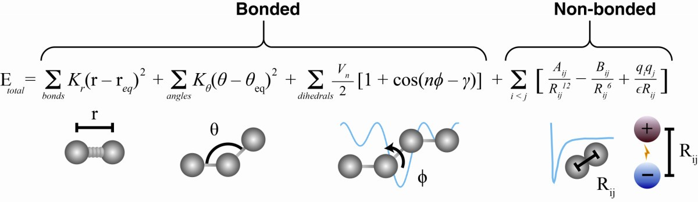

+++
title = "ML for Molecular Dynamics"
date = 2018-10-23T09:37:04-04:00
draft = false

# Tags: can be used for filtering projects.
# Example: `tags = ["machine-learning", "deep-learning"]`
tags = []

# Project summary to display on homepage.
summary = "Using AI/ML for scaling Molecular Dynamics simulations of proteins. "

# Slides (optional).
#   Associate this page with Markdown slides.
#   Simply enter your slide deck's filename without extension.
#   E.g. `slides = "example-slides"` references 
#   `content/slides/example-slides.md`.
#   Otherwise, set `slides = ""`.
slides = ""

# Optional external URL for project (replaces project detail page).
external_link = ""

# Links (optional).
url_pdf = ""
url_code = ""
url_dataset = ""
url_slides = ""
url_video = ""
url_poster = ""

# Custom links (optional).
#   Uncomment line below to enable. For multiple links, use the form `[{...}, {...}, {...}]`.
# links = [{icon_pack = "fab", icon="twitter", name="Follow", url = "https://twitter.com"}]

# Featured image
# To use, add an image named `featured.jpg/png` to your page's folder. 
[image]
  # Caption (optional)
  caption = ""

  # Focal point (optional)
  # Options: Smart, Center, TopLeft, Top, TopRight, Left, Right, BottomLeft, Bottom, BottomRight
  focal_point = ""
+++

Molecular Dynamics is a computational method for simulating the movement of atoms and molecules. For each atom in a given protein, several forces are computed and then integrated in time to estimate the dynamic motion of the atoms and of molecules. The forces/energies computed are:

* a force for each chemical bond
* an angle term (atoms have certain angles they are positioned at)
* dihedral angles (whether or not 4 atoms are all in the same plane) 
* the [Lennard-Jones](https://en.wikipedia.org/wiki/Lennard-Jones_potential) potential modelling soft repulsive and attractive (van der Waals) forces 
* [Columbus forces](https://en.wikipedia.org/wiki/Coulomb%27s_law) for electrostatics 

MD simulations are crucial for simulating biological processes, for screening for novel drugs, as well as other applications such as material science. However, many very interesting applications such as protein-protein interactions, ligand binding require repeated, long MD simulations, which are often intractable. Machine Learning and AI, by approximating the computation of all the movements of atoms over time, can significantly speed up Molecular Dynamics, or enable it for very large systems (in the order of millions to billions of atoms). We're also interested to use ML to learn more accurate force field potentials, perhaps from Density Functional Theory or for coarse-grained models.

**I'm a student interested in working on this. What do I do?**

If you've never heard of Molecular Dynamics, run 1-2 simulations in OpenMM first using some protein structure downloaded from the protein data bank ([RCSB](https://rcsb.org/)). Google for "OpenMM tutorial/getting started". Once you generate a trajectory, try to visualize it using nglviewer. You should see the atoms moving around and the protein "wriggle", which is an expected behaviour given the short simulation you've just run. Then once you read these two papers, you are ready to go through the further reading below. Once you are decided that you'd like to work on this project, send me an email.

* OpenMM 8: https://browse.arxiv.org/pdf/2310.03121.pdf
* NAMD simulator: https://onlinelibrary.wiley.com/doi/10.1002/jcc.20289

**Further reading:**

* [Noe et al, Machine Learning for Molecular Simulation, 2020](https://www.annualreviews.org/doi/10.1146/annurev-physchem-042018-052331)
* [Doerr et al, TorchMD: A Deep Learning Framework for Molecular Simulations, 2021](https://pubs.acs.org/doi/10.1021/acs.jctc.0c01343)
* Universal ML-based MD propagator: https://arxiv.org/abs/2310.18278
* Machine Learning Coarse-Grained Potentials of Protein Thermodynamics: https://arxiv.org/pdf/2212.07492.pdf
* Learning multi scale interatomic potentials. Xiang Fu 2023, https://arxiv.org/abs/2310.13756
* NeuralMD: https://chao1224.github.io/NeuralMD
* PaiNN, Schutt et al, 2021, Equivariant message passing for the prediction of tensorial properties and molecular spectra: https://arxiv.org/abs/2102.03150
* CDConv: Continuous-Discrete Convolution for Geometry-Sequence Modeling in Proteins https://openreview.net/pdf?id=P5Z-Zl9XJ7

