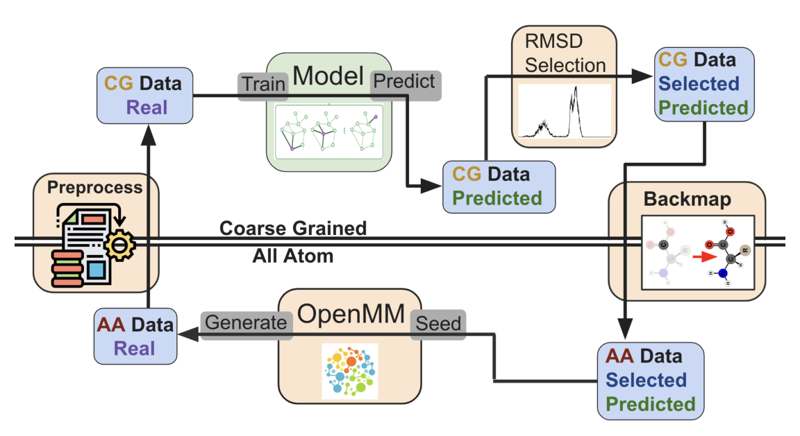

+++
title = "Active Learning for Machine Learning Driven Molecular Dynamics"
date = 2025-12-06T12:00:00Z
authors = ["Kevin Bachelor", "Sanya Murdeshwar", "Daniel Sabo", "Razvan Marinescu"]
publication_types = ["1"]
publication = "NeurIPS 2025 Machine Learning and the Physical Sciences Workshop"
publication_short = "NeurIPS 2025 Machine Learning and the Physical Sciences Workshop"
abstract = "By requesting new training data when trajectories reach poorly sampled configurations, our active learning framework improves coarse-grained molecular simulations."
summary = "By requesting new training data when trajectories reach poorly sampled configurations, our active learning framework improves coarse-grained molecular simulations."
doi = ""
featured = false
tags = []
projects = []
url_pdf = "https://arxiv.org/pdf/2509.17208"
url_preprint = "https://arxiv.org/abs/2509.17208"
links = [{name = "Publication", url = "https://arxiv.org/abs/2509.17208"}]
[image]
  caption = "Figure 1: Active learning pipeline"
  focal_point = "Center"
+++

By requesting new training data when trajectories reach poorly sampled configurations, our [active learning framework](https://arxiv.org/abs/2509.17208) improves coarse-grained molecular simulations.

Figure 1: Active learning pipeline. [Source paper, page 3](https://arxiv.org/pdf/2509.17208).
