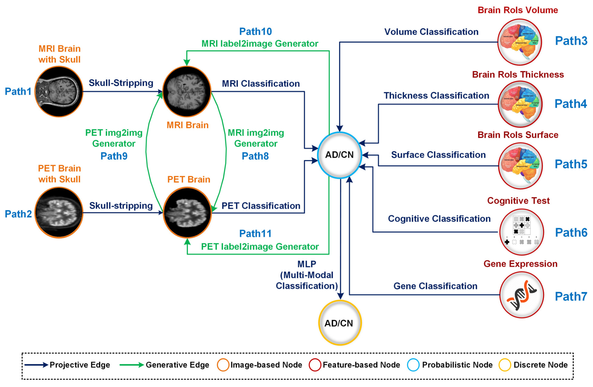

+++
title = "A multi-modal graph-based framework for Alzheimer’s disease detection"
date = 2025-07-03T12:00:00Z
authors = ["Najmeh Mashhadi", "Razvan Marinescu"]
publication_types = ["2"]
publication = "Scientific Reports, 15, 22684"
publication_short = "Scientific Reports, 15, 22684"
abstract = "A new paper in Scientific Reports combines modular machine learning models, imaging, genetics, and cognitive tests for Alzheimer’s detection, including when some data modalities are missing."
summary = "A new paper in Scientific Reports combines modular machine learning models, imaging, genetics, and cognitive tests for Alzheimer’s detection, including when some data modalities are missing."
doi = "10.1038/s41598-025-05966-2"
featured = false
tags = []
projects = []
url_pdf = "https://www.nature.com/articles/s41598-025-05966-2.pdf"
url_preprint = ""
links = [{name = "Publication", url = "https://www.nature.com/articles/s41598-025-05966-2"}]
[image]
  caption = "Figure 1: Compositional graph for Alzheimer’s disease detection"
  focal_point = "Center"
+++

A [new paper in Scientific Reports](https://www.nature.com/articles/s41598-025-05966-2) combines modular machine learning models, imaging, genetics, and cognitive tests for Alzheimer’s detection, including when some data modalities are missing.

Figure 1: Compositional graph for Alzheimer’s disease detection. [Source paper, page 2](https://www.nature.com/articles/s41598-025-05966-2.pdf).
