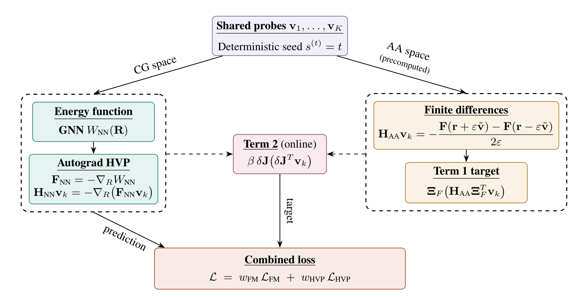

+++
title = "Hessian Matching for Machine-Learned Coarse-Grained Molecular Dynamics"
date = 2026-05-12T12:00:00Z
authors = ["Sanya Murdeshwar", "Sanjit Shashi", "Kevin Bachelor", "William Noid", "Razvan Marinescu"]
publication_types = ["3"]
publication = "arXiv preprint"
publication_short = "arXiv preprint"
abstract = "Hessian Matching improves coarse-grained molecular simulations by teaching neural potentials the curvature of the free-energy landscape."
summary = "Hessian Matching improves coarse-grained molecular simulations by teaching neural potentials the curvature of the free-energy landscape."
doi = ""
featured = false
tags = []
projects = []
url_pdf = "https://arxiv.org/pdf/2605.12823"
url_preprint = "https://arxiv.org/abs/2605.12823"
links = [{name = "Publication", url = "https://arxiv.org/abs/2605.12823"}]
[image]
  caption = "Figure 1: Hessian-vector product matching pipeline"
  focal_point = "Center"
+++

[Hessian Matching](https://arxiv.org/abs/2605.12823) improves coarse-grained molecular simulations by teaching neural potentials the curvature of the free-energy landscape.

Figure 1: Hessian-vector product matching pipeline. [Source paper, page 6](https://arxiv.org/pdf/2605.12823).
