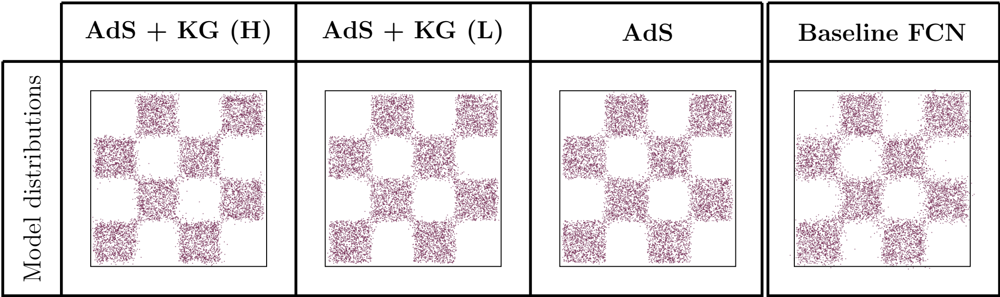

+++
title = "Holographic generative flows with AdS/CFT"
date = 2026-09-18T12:00:00Z
authors = ["Ehsan Mirafzali", "Sanjit Shashi", "Sanya Murdeshwar", "Edgar Shaghoulian", "Daniele Venturi", "Razvan Marinescu"]
publication_types = ["2"]
publication = "Machine Learning: Science and Technology"
publication_short = "Machine Learning: Science and Technology"
abstract = "Inspired by the AdS/CFT correspondence, Holographic Generative Flows introduces a physics-based framework for generative flow matching, accepted in Machine Learning: Science and Technology."
summary = "Inspired by the AdS/CFT correspondence, Holographic Generative Flows introduces a physics-based framework for generative flow matching, accepted in Machine Learning: Science and Technology."
doi = ""
featured = false
tags = []
projects = []
url_pdf = "https://arxiv.org/pdf/2601.22033"
url_preprint = "https://arxiv.org/abs/2601.22033"
links = [{name = "Publication", url = "https://arxiv.org/abs/2601.22033"}]
[image]
  caption = "Figure 2 (model distributions): Checkerboard samples from AdS + KG (H), AdS + KG (L), AdS, and the baseline FCN"
  focal_point = "Center"
  fit = true
+++

Figure 2 (model distributions): Checkerboard samples from AdS + KG (H), AdS + KG (L), AdS, and the baseline FCN. [Source paper, page 12](https://arxiv.org/pdf/2601.22033).
