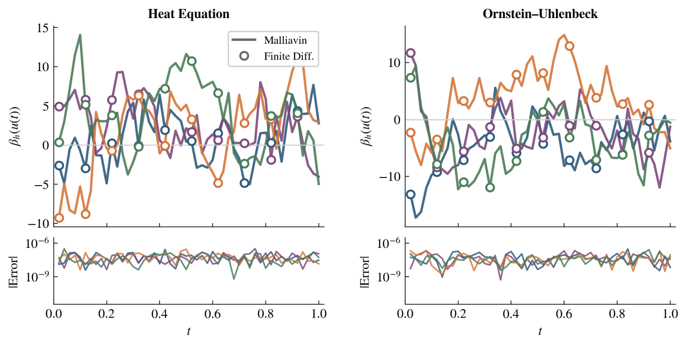

+++
title = "Score-Based Diffusion Models in Infinite Dimensions: A Malliavin Calculus Perspective"
date = 2026-03-26T12:00:00Z
authors = ["Ehsan Mirafzali", "Frank Proske", "Daniele Venturi", "Razvan Marinescu"]
publication_types = ["2"]
publication = "Journal of Machine Learning for Modeling and Computing, 7(2)"
publication_short = "Journal of Machine Learning for Modeling and Computing, 7(2)"
abstract = "Malliavin calculus provides a foundation for score-based diffusion models in infinite dimensions, with score formulas for generative modelling in function spaces."
summary = "Malliavin calculus provides a foundation for score-based diffusion models in infinite dimensions, with score formulas for generative modelling in function spaces."
doi = ""
featured = false
tags = []
projects = []
url_pdf = "https://arxiv.org/pdf/2508.20316"
url_preprint = "https://arxiv.org/abs/2508.20316"
links = [{name = "Publication", url = "https://arxiv.org/abs/2508.20316"}]
[image]
  caption = "Figure 1 (top panels): Numerical validation of the Malliavin score formula for the heat equation and Ornstein–Uhlenbeck process"
  focal_point = "Center"
  fit = true
+++

Figure 1 (top panels): Numerical validation of the Malliavin score formula for the heat equation and Ornstein–Uhlenbeck process. [Source paper, page 20](https://arxiv.org/pdf/2508.20316).
