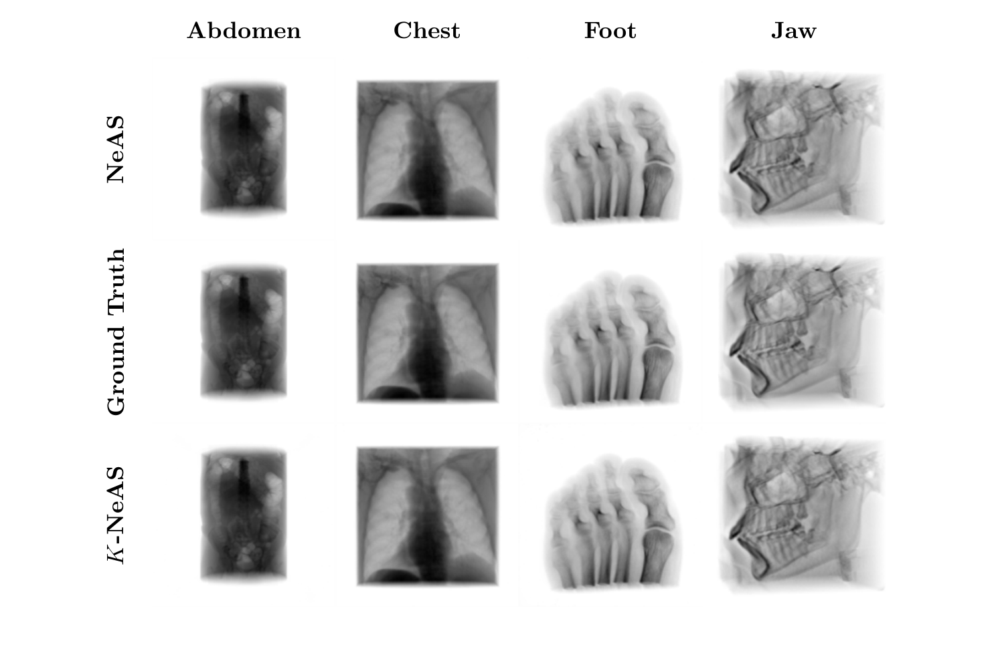

+++
title = "K-NeAS: Scalable Multi-Material CT Reconstruction Using Neural SDFs"
date = 2026-07-15T12:00:00Z
authors = ["Daksh K. Shah", "Emmanouil Nikolakakis", "Razvan Marinescu"]
publication_types = ["1"]
publication = "MICCAI 2026 Off-Grid Workshop"
publication_short = "MICCAI 2026 Off-Grid Workshop"
abstract = "Accepted for an oral presentation at MICCAI’s Off-Grid workshop, K-NeAS reconstructs multiple tissue types from sparse CT measurements using neural surface representations."
summary = "Accepted for an oral presentation at MICCAI’s Off-Grid workshop, K-NeAS reconstructs multiple tissue types from sparse CT measurements using neural surface representations."
doi = ""
featured = false
tags = []
projects = []
url_pdf = "https://arxiv.org/pdf/2607.14415"
url_preprint = "https://arxiv.org/abs/2607.14415"
links = [{name = "Publication", url = "https://arxiv.org/abs/2607.14415"}]
[image]
  caption = "Figure 4: CT reconstruction comparisons"
  focal_point = "Center"
+++

Figure 4: CT reconstruction comparisons. [Source paper, page 7](https://arxiv.org/pdf/2607.14415).
