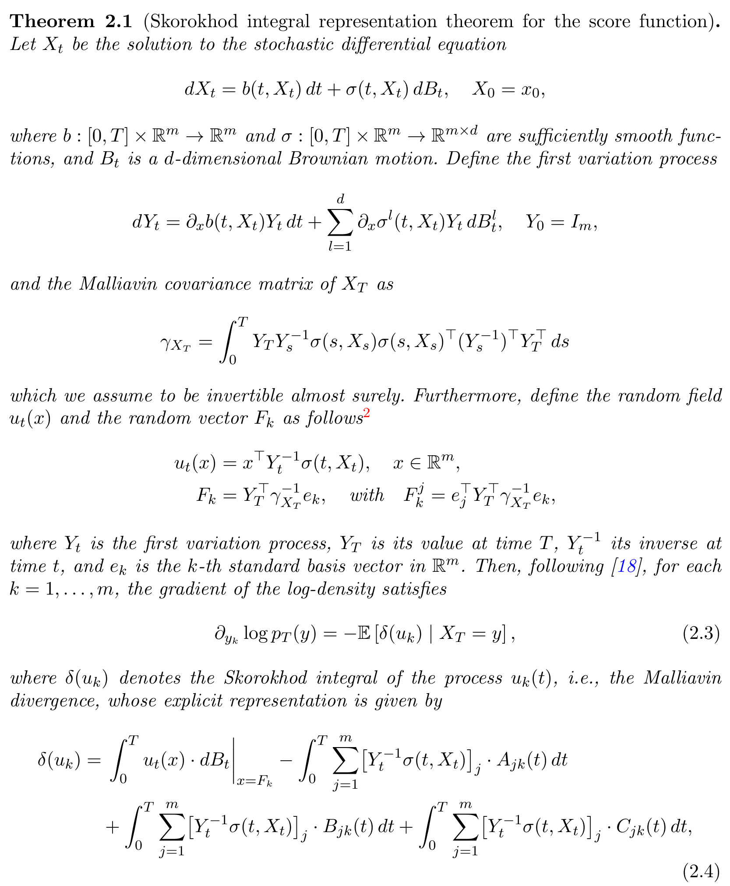

+++
title = "A Malliavin calculus approach to score functions in diffusion generative models"
date = 2025-07-08T12:00:00Z
authors = ["Ehsan Mirafzali", "Frank Proske", "Utkarsh Gupta", "Daniele Venturi", "Razvan Marinescu"]
publication_types = ["3"]
publication = "arXiv preprint"
publication_short = "arXiv preprint"
abstract = "A Malliavin calculus framework derives score functions for nonlinear diffusion models using first and second variation processes and a new Bismut-type formula."
summary = "A Malliavin calculus framework derives score functions for nonlinear diffusion models using first and second variation processes and a new Bismut-type formula."
doi = ""
featured = false
tags = []
projects = []
url_pdf = "https://arxiv.org/pdf/2507.05550"
url_preprint = "https://arxiv.org/abs/2507.05550"
links = [{name = "Publication", url = "https://arxiv.org/abs/2507.05550"}]
[image]
  caption = "Theorem 2.1: Score-function representation (equation excerpt; this paper contains no figures)"
  focal_point = "Center"
+++

A Malliavin calculus framework derives score functions for nonlinear diffusion models using first and second variation processes and a new Bismut-type formula.

Theorem 2.1: Score-function representation (equation excerpt; this paper contains no figures). [Source paper, page 4](https://arxiv.org/pdf/2507.05550).
