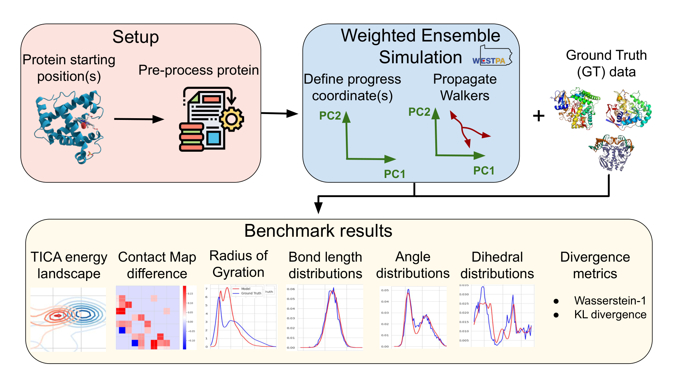

+++
title = "A Standardized Benchmark for Machine-Learned Molecular Dynamics using Weighted Ensemble Sampling"
date = 2025-12-05T12:00:00Z
authors = ["Alexander Aghili", "Andy Bruce", "Daniel Sabo", "Sanya Murdeshwar", "Kevin Bachelor", "Ionut Mistreanu", "Ashwin Lokapally", "Razvan Marinescu"]
publication_types = ["2"]
publication = "The Journal of Physical Chemistry B, 129(50), 12828–12840"
publication_short = "The Journal of Physical Chemistry B, 129(50), 12828–12840"
abstract = "Published in The Journal of Physical Chemistry B, our molecular dynamics benchmark enables reproducible comparisons across nine proteins using weighted ensemble sampling."
summary = "Published in The Journal of Physical Chemistry B, our molecular dynamics benchmark enables reproducible comparisons across nine proteins using weighted ensemble sampling."
doi = "10.1021/acs.jpcb.5c05365"
featured = false
tags = []
projects = []
url_pdf = "https://arxiv.org/pdf/2510.17187"
url_preprint = "https://arxiv.org/abs/2510.17187"
links = [{name = "Publication", url = "https://doi.org/10.1021/acs.jpcb.5c05365"}]
[image]
  caption = "Figure 1: Weighted ensemble benchmarking framework"
  focal_point = "Center"
+++

Figure 1: Weighted ensemble benchmarking framework. [Source paper, page 5](https://arxiv.org/pdf/2510.17187).
