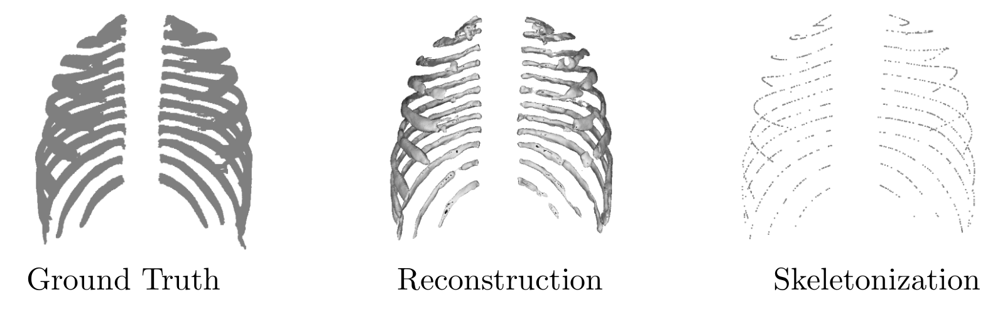

+++
title = "RibPull: Implicit Occupancy Fields and Medial Axis Extraction for CT Ribcage Scans"
date = 2026-02-15T12:00:00Z
authors = ["Emmanouil Nikolakakis", "Amine Ouasfi", "Julie Digne", "Razvan Marinescu"]
publication_types = ["1"]
publication = "SPIE Medical Imaging 2026: Image Processing"
publication_short = "SPIE Medical Imaging 2026: Image Processing"
abstract = "Introducing RibPull: continuous neural representations of CT ribcages that enable extraction of their skeletal structure."
summary = "Introducing RibPull: continuous neural representations of CT ribcages that enable extraction of their skeletal structure."
doi = ""
featured = false
tags = []
projects = []
url_pdf = "https://arxiv.org/pdf/2509.01402"
url_preprint = "https://arxiv.org/abs/2509.01402"
links = [{name = "Publication", url = "https://arxiv.org/abs/2509.01402"}]
[image]
  caption = "Figure 1: RibPull methodology"
  focal_point = "Center"
  fit = true
+++

Figure 1: RibPull methodology. [Source paper, page 2](https://arxiv.org/pdf/2509.01402).
