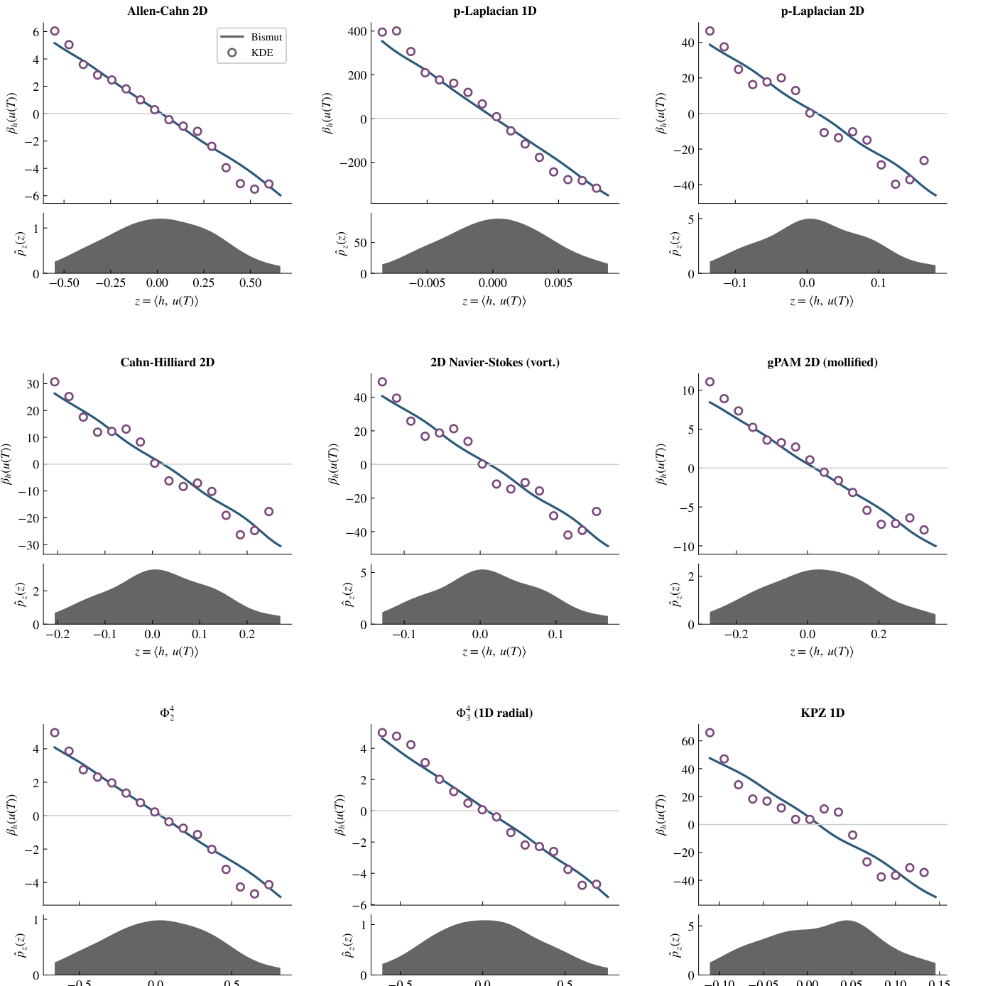

+++
title = "Logarithmic derivatives of variational and singular stochastic partial differential equations"
date = 2026-08-22T12:00:00Z
authors = ["Ehsan Mirafzali", "Frank Proske", "Razvan Marinescu"]
publication_types = ["3"]
publication = "arXiv preprint"
publication_short = "arXiv preprint"
abstract = "A new stochastic PDE preprint derives logarithmic derivatives of solution distributions for variational and singular stochastic partial differential equations."
summary = "A new stochastic PDE preprint derives logarithmic derivatives of solution distributions for variational and singular stochastic partial differential equations."
doi = ""
featured = false
tags = []
projects = []
url_pdf = "https://arxiv.org/pdf/2608.21805"
url_preprint = "https://arxiv.org/abs/2608.21805"
links = [{name = "Publication", url = "https://arxiv.org/abs/2608.21805"}]
[image]
  caption = "Figure 1: Numerical validation across stochastic PDEs"
  focal_point = "Center"
+++

Figure 1: Numerical validation across stochastic PDEs. [Source paper, page 143](https://arxiv.org/pdf/2608.21805).
