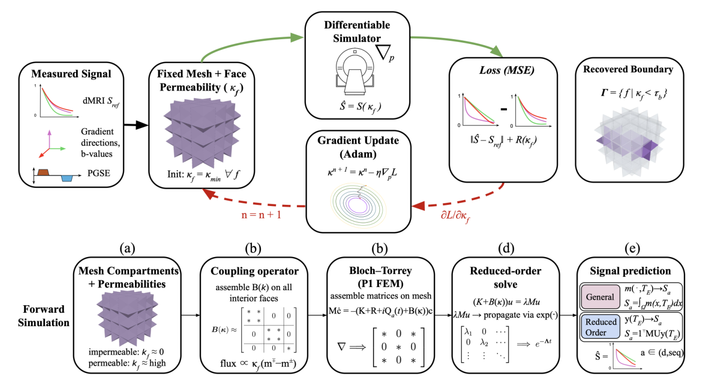

+++
title = "Spinverse: Differentiable Physics for Permeability-Aware Microstructure Reconstruction from Diffusion MRI"
date = 2026-03-04T12:00:00Z
authors = ["Prathamesh Pradeep Khole", "Mario M. Brenes", "Zahra Kais Petiwala", "Ehsan Mirafzali", "Utkarsh Gupta", "Jing-Rebecca Li", "Andrada Ianus", "Razvan Marinescu"]
publication_types = ["3"]
publication = "arXiv preprint"
publication_short = "arXiv preprint"
abstract = "Spinverse uses differentiable physics to reconstruct tissue boundaries and permeability from simulated diffusion MRI measurements."
summary = "Spinverse uses differentiable physics to reconstruct tissue boundaries and permeability from simulated diffusion MRI measurements."
doi = ""
featured = false
tags = []
projects = []
url_pdf = "https://arxiv.org/pdf/2603.04638"
url_preprint = "https://arxiv.org/abs/2603.04638"
links = [{name = "Publication", url = "https://arxiv.org/abs/2603.04638"}]
[image]
  caption = "Figure 1: Spinverse reconstruction pipeline"
  focal_point = "Center"
+++

Figure 1: Spinverse reconstruction pipeline. [Source paper, page 3](https://arxiv.org/pdf/2603.04638).
