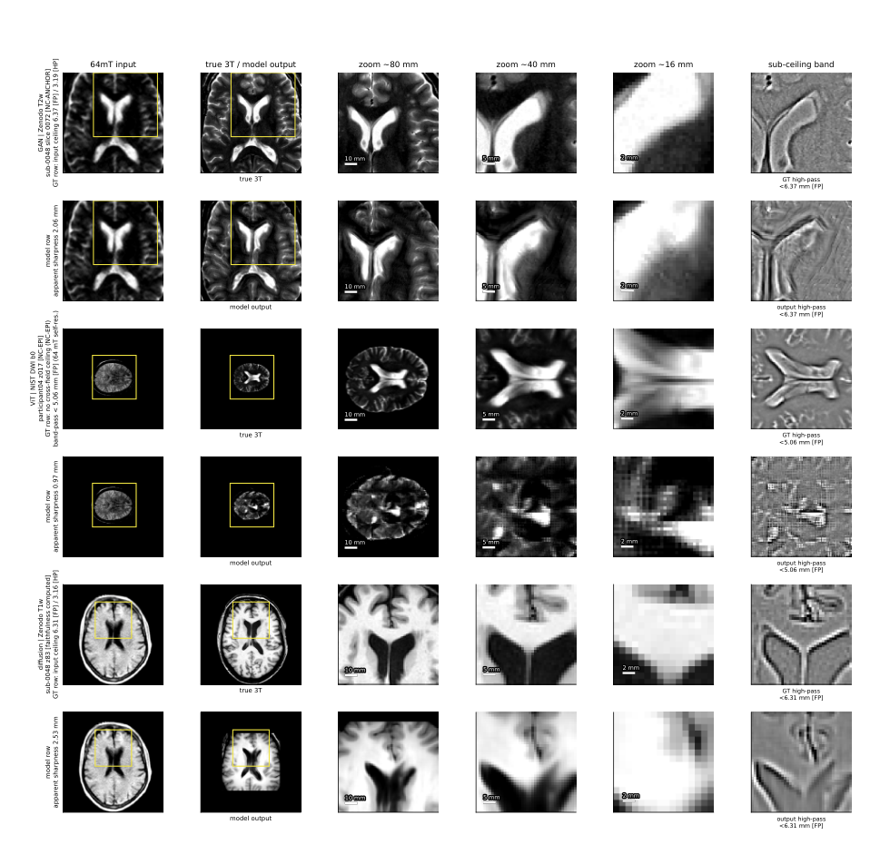

+++
title = "You Cannot Recover What Was Never Measured: Quantifying the Information Ceiling of Ultra-Low-Field MRI Super-Resolution"
date = 2026-09-29T12:00:00Z
authors = ["Prathamesh Pradeep Khole", "Shreya Handa", "Utkarsh Gupta", "Razvan Marinescu"]
publication_types = ["3"]
publication = "arXiv preprint"
publication_short = "arXiv preprint"
abstract = "How much detail can ultra-low-field MRI recover? Our new study quantifies the information ceiling and shows that tested super-resolution models generate fine structures unsupported by the measurements."
summary = "How much detail can ultra-low-field MRI recover? Our new study quantifies the information ceiling and shows that tested super-resolution models generate fine structures unsupported by the measurements."
doi = ""
featured = false
tags = []
projects = []
url_pdf = "https://arxiv.org/pdf/2609.36837"
url_preprint = "https://arxiv.org/abs/2609.36837"
links = [{name = "Publication", url = "https://arxiv.org/abs/2609.36837"}]
[image]
  caption = "Figure 3: Anatomical detail and the measured information ceiling"
  focal_point = "Center"
  fit = true
+++

Figure 3: Anatomical detail and the measured information ceiling. [Source paper, page 18](https://arxiv.org/pdf/2609.36837).
